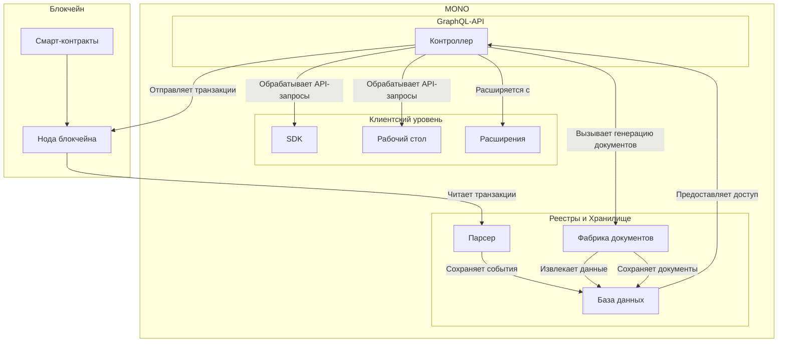

`MONO` состоит из следующих архитектурных компонент:

- Парсер. Считывает данные о произведенных действиях из транзакций блокчейна и сохраняет их для дальнейшего извлечения. 

- Фабрика. Генерирует документы на основе шаблонов и произведенных действий, извлеченных из блокчейна. Сохраняет документы и предоставляет доступ к ним. 

- Контроллер. Обеспечивает контроль доступа к фабрике, действиям блокчейна, мутациям, запросам и подпискам через GraphQL-API. 

- SDK. Предоставляет набор инструментов для подключения к контроллеру, блокчейну, кошельку, и т.д.

- Рабочий стол. Предоставляет пользовательские интерфейсы рабочих столов для пайщиков и администрации кооператива. 

<!-- - Терминал. Предоставляет набор инструментов командной строки для доступа к блокчейну.  -->

- Блокчейн. Нода блокчейна подключается к общей сети нод и непрерывно синхронизирует информацию в распределенной базе данных. 

- Документация. Техническая документация к `MONO`, `SDK` и `GraphQL-API`

- Расширения. Программы, расширяющие функционал контроллера и рабочих столов. 

- База данных. Используется парсером, фабрикой и контроллером для хранения и извлечения информации. 

- Смарт-контракты. Хранят и исполняют целевые потребительские программы в блокчейне.

## Стек
Блокчейн: ANTELOPE, C/C++

Смарт-контракты: C/C++

Рабочие столы: QUASAR, VueJS, Typescript 

Контроллер MONO: NestJS, Typescript

SDK: Typescript

Парсер: Express, Typescript

Фабрика документов: Typescript

База данных: Mongo (legacy) & Postgres

