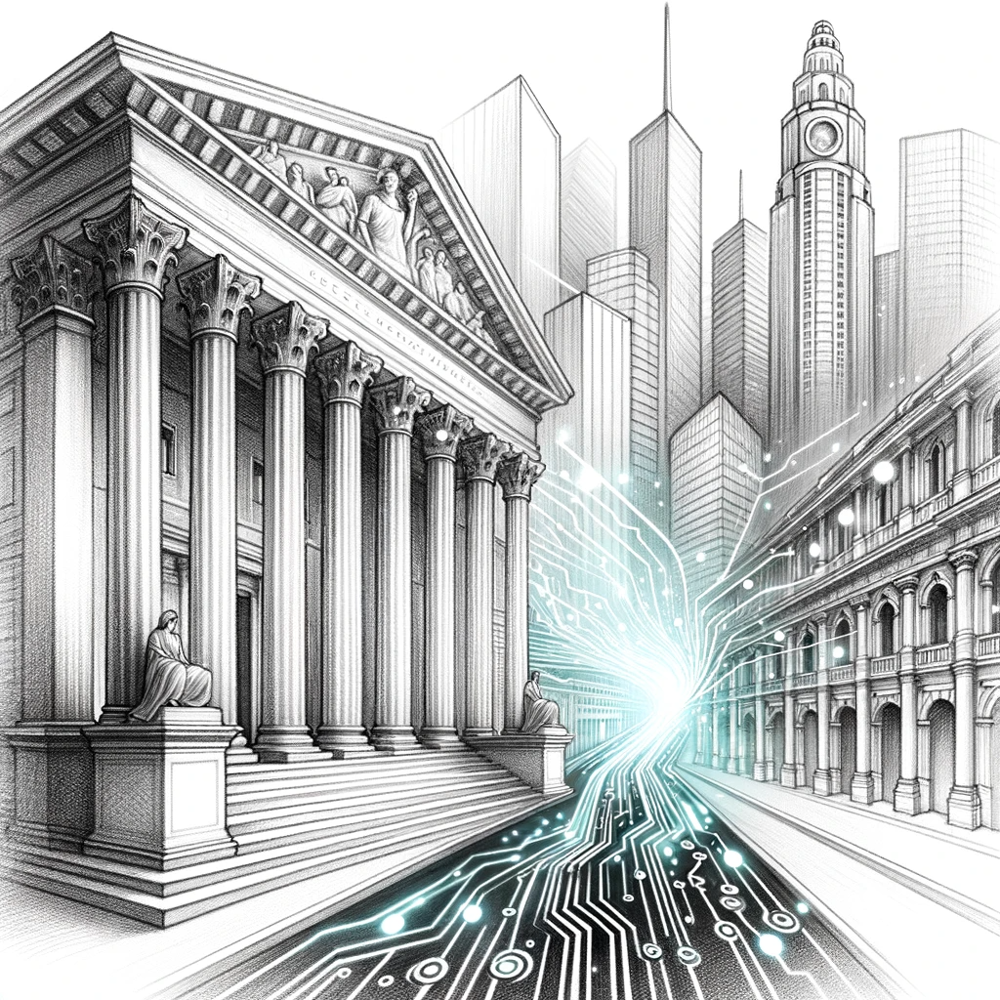
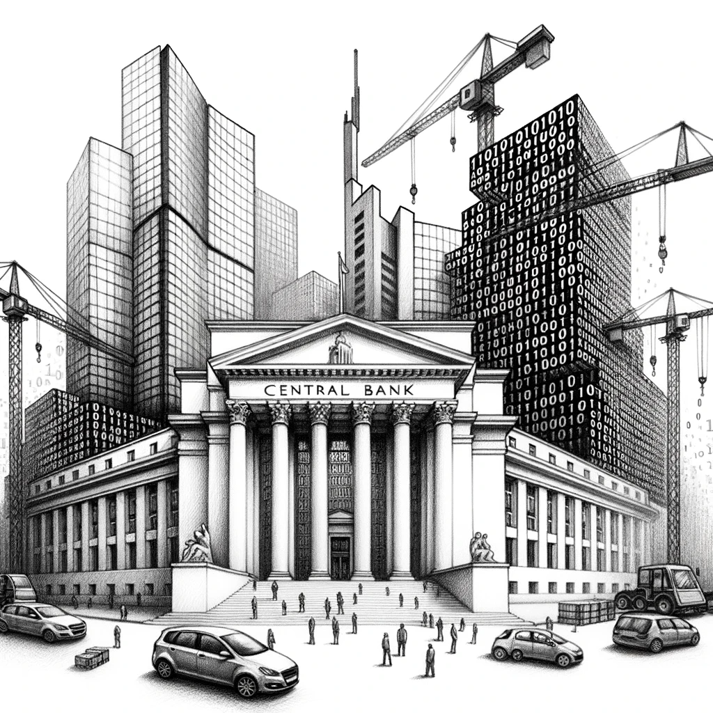
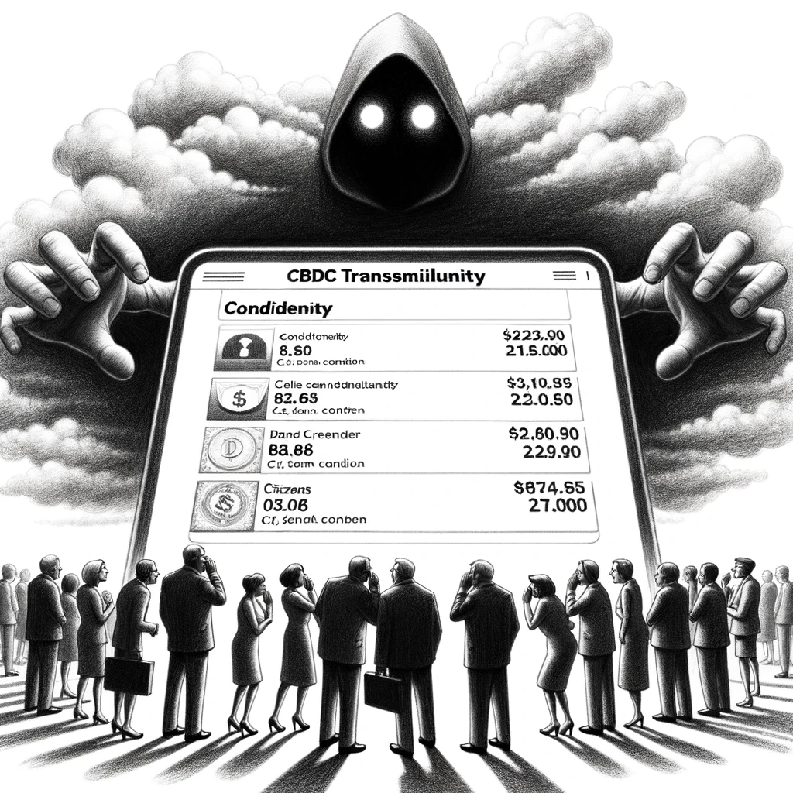

# Доктрина

Каждое событие, каждое действие и каждое живое существо являются частями одной бесконечной цепи причин и следствий. Наш мир, как сложная система наблюдаемых нами взаимосвязанных предметов и процессов Вселенной, непрерывно течёт из прошлого - в настоящее, а из настоящего - в будущее, и постоянно меняется. 

Но люди остаются людьми. В этой бесконечной смене событий и времён мы пытаемся удержать в памяти лица и имена своих предков. Однако наша память очень хрупка. Мы помним лишь несколько поколений — родных, которых видели своими глазами, слышали их истории. Мы с трудом можем припомнить имя прадеда или представить лицо прапрабабушки.

И даже эта скромная память часто искажена. То, что мы храним в сердцах, не передает всей глубины их жизни. Рассказы, фотографии, записанные истории дают лишь блеклое представление о том, кем были наши предки на самом деле, в чем заключался их смысл жизни, что они чувствовали и о чем мечтали.

Перед каждым из нас всегда стоят вызовы времени. Каждый раз, когда мы сталкиваемся с ними, мы принимаем решения — действуем или бездействуем. Эти решения оказывают прямое влияние на нашу жизнь, формируя её смысл. Даже бездействие — это своего рода выбор, несущий свой смысл и последствия. Наши действия становятся материалом, из которого складывается история нашей жизни.

Если бы мы могли точно определять смысл каждого своего действия, измерять его значимость, передавать этот смысл и сохранять его для будущих поколений, мы достигли бы духовного бессмертия. Осознав себя частью единого сознания, непрерывно перетекающего через века, мы смогли бы передавать свой опыт и знания, сохраняя их с предельной точностью.

В передаче смысла жизни поколений лежит огромный потенциал. Осознавая себя как часть единого живого организма, состоящего из жизни человеческих душ, мы сможем планировать и строить будущее на века вперёд. В этом едином сознании стираются границы времени, и мы сохраняем свою сущность на веки.

Принимая смысл жизни наших предков, отражённый в их знаниях о мире, и передавая его в будущее, мы не просто продолжаем линию существования. Мы добавляем к этому знанию свои открытия, переживания и осознания. Таким образом, мы формируем непрерывную связь поколений, наполняем свою жизнь глубоким смыслом и обретаем духовное бессмертие. 


## Платформа поколений
Знания — это ключ к созданию платформы поколений. Они зашифровывают все явления мира, раскрываясь в действиях каждого человека во все времена. Люди всегда опираются на свои знания о мире, чтобы принимать решения и действовать. Именно благодаря знаниям мы познаём и описываем Вселенную.

!!! note "Что такое знание?"

Знание — субъективный образ ощущений и осмыслений взаимосвязанных предметов и процессов Вселенной. 

С рождения каждый человек стремится построить свой уникальный Мир. Начав с простых ощущений, таких как звуки и прикосновения, ребёнок продолжает усложнять свои познания, наблюдая за окружающим его миром. Постепенно у него формируется взаимосвязанный образ знаний о Вселенной — его персональный Мир.

Каждый такой образ знаний является субъективным, основанным на личном практическом опыте человека. Во всём мире не найдётся двух людей с одинаковыми знаниями; у каждого из нас свой уникальный Мир, сформированный индивидуально.

Айзек Азимов отмечал, что два человека, будучи уверены в безупречности своих знаний о мире, могут найти бесконечное количество логических комбинаций и взаимосвязей, доказывающих, что их Мир — верный. Однако, ни один из них не сможет доказать, что Мир другого — ложный.

Эта невозможность объединить наши индивидуальные миры порождает противоречия, ведущие к разделению и конфликтам. Мы не можем договориться, потому что нам недостаёт единого языка, который позволял бы однозначно понимать друг друга.

Наш Мир основан на языке, который мы используем для описания процессов и предметов Вселенной. Однако язык состоит из слов, и каждое слово имеет своё индивидуальное значение для каждого человека. Таким образом, даже если мы говорим на одном языке, мы можем оставаться непонятыми.

Эту проблему невозможно решить без специальных инструментов работы со знаниями. Нам жизненно необходима единая, живая, непротиворечивая и действующая модель знаний о Вселенной, которая бы соединяла наши индивидуальные миры и проявляла бы их объективный смысл.


### Единое сознание
Единое сознание - это действующая модель мира, которая хранит и передаёт себя из прошлого в будущее. Каждый человек в своём существе смотрит на мир глазами единого сознания и совершает вклад в него своими действиями. Все наши поступки и их результаты создают полотно коллективного опыта, закладывая основу для следующего витка эволюции. 

Единое сознание держит в руках своё будущее в вечном настоящем. Его руки - это руки каждого человека, как части единого живого духовно-бессмертного организма, передающего саму жизнь из поколения в поколение. В нём нет разделения на "он" и "они"; наши личные достижения становятся частью общего, объединяющего нас смысла. Это осознание порождает ответственность перед собой и другими, стимулируя нас к действиям ради общего блага - самой жизни.

Для того, чтобы собрать в единое сознание разрозненные миры людей, необходимо найти способ непротиворечивого описания знаний каждого из нас, которые выражаются в действиях и несут свой смысл. Тогда мы, буквально, увидим себя сквозь время так, как никогда не видели раньше. Объединение различных действий и их результатов в одну гармоничную систему позволит нам выйти из череды конфликтов и противоречий, разрушающих нас и наш мир.

Каждое действие, каждый результат, запечатленные в едином сознании, становятся частью великой мозаики, отображающей нашу общую судьбу - книги жизни. Понимание и принятие разнообразия человеческого опыта обогащает нас, помогая находить решения для самых сложных задач. 

Так, подлинное осознание единого сознания ведет нас к трансформации в новую форму общественной жизни. Мы увидим мир глазами бесчисленных поколений предков и потоков, и наше внимание расширится, охватив все аспекты бытия - от личного до космического. В этом процессе слияния и интеграции мы обретем целостность, которая поможет нам обрести Мир и познать Вселенную.


### Смысл знаний

Объективная польза, которую мы можем извлечь из Знаний, - это их смысл. Когда мы узнаем что-то о Вселенной, что необходимо другим людям, мы получаем их благодарность. Эта благодарность становится выражением объективной пользы, которую нам приносят знания.

Смысл знаний определяется их полезным влиянием на нас. Те знания, которые оказывают благотворное воздействие, обладают смыслом. И напротив, знания, не приносящие пользы, оказываются бессмысленными. Они напоминают пустые оболочки, лишенные внутреннего содержания и направленности.

Если знание приносит пользу, то оно обретает смысл. Этот смысл можно измерить объективно - с помощью улыбок, исходящих от людей, и прочих показателей, которыми мы пользуемся в нашем движении сквозь поколения. Эти метрики становятся маяками на пути, направляя нас и объединяя.

Экономические системы будут меняться, но память о людях и их знаниях останется. Измерение благодарности за объективную пользу знаний зависит лишь от того, как мы договорились это делать. Сегодня в качестве инструмента используются деньги, но завтра возможны иные формы выражения благодарности. В контексте единого сознания поколений это всего лишь игра с определенными и принятыми людьми правилами.

Несмотря на то, как именно выражается благодарность в конкретной экономической системе, смысл знаний для людей остается неизменным - это польза, которую они могут извлечь для себя и своего мира. Так, в едином сознании, обладающим информацией о действиях и их результатах сквозь поколения, мы получим возможность оценки вклада на предмет смысла - а сколько улыбок (или других метрик) принесли людям именно эти знания, добытые конкретным человеком. 

Добыча и передача знаний становится важнейшей задачей человеческого существования. Вместе с этим пониманием приходит ответственность - понимание того, что наши действия и наши знания определяют не только нас самих, но и тех, кто следует за нами. В этом контексте знание трансформируется: оно становится актом созидания, вливающимся в поток жизни единого сознания и измеримо влияет на будущее.


### Критерий знаний
Как определить, что является знанием, а что — нет? 

Практика — это объективный критерий знания. Когда мы совершаем любые действия, мы ожидаем получить результат. Учёный, ставя эксперимент, ожидает результат. Какой именно — ему не всегда известно заранее, но он знает, как поставить эксперимент так, чтобы иметь возможность получить результата. Для этого, как минимум, он устанавливает датчик туда, где ожидает эффект.

Каждый день миллионы людей производят полезные продукты, совершая действия для получения ожидаемого результата. Если бы они не знали, как и что нужно делать, они бы не смогли производить результат. Так, на основе знаний строится любое производство результата. 

Мы строим ракеты, потому что знаем, как и почему они летают. Без практики применения миллиардов единиц проверенных практикой знаний, объединённых в сети научных доктрин, люди бы никогда не смогли отправить человека в космос. Но они смогли!

Практика — критерий знания. Только посредством практики мы можем определить ценность того, что знаем. Если мы можем применять единицу знания и извлекать из неё пользу, - то мы это знаем. Если применение невозможно, то и знания нет, или оно непроверяемое, или еще не проверенно.  

Платформа единого сознания поколений людей должна соединить субъективные миры знаний людей и непрерывно проверять их в действии. Так мы найдём единый источник знаний обо всём, который содержит в себе смысл жизни поколений людей и смысл жизни каждого человека, из которых этот источник и состоит.


### Язык знаний

В основе наших персональных знаний о мире лежат неопровержимые базовые истины (аксиомы), которые каждый может легко проверить. Например, каждый может убедиться, что на Земле в нормальных условиях яблоки падают вниз, целое больше частного, а между двумя точками можно провести только одну прямую. 

Весь наш образ знаний о мире базируется на аксиомах. Нам не нужно доказывать себе или кому-либо еще, что мы не ходим по потолку и не дышим водой. Мы просто это знаем, и совершенно абсурдно пытаться доказать обратное. Эти аксиомы не требуют доказательств. Мы все это знаем, и в этом мы едины. 

Вселенная закодирована знаниями, а мы изучаем её код. Мы основываемся на аксиомах и всеми доступными нам способами познаём явления - предметы или процессы Вселенной. 

Все наши знания о Вселенной, как и сама Вселенная, состоят из взаимосвязанных и повторяющихся предметов и процессов, или, явлений. Что есть общего во всех знаниях? На каком языке мы описываем знания самим себе? 

#### Форма

Мы всегда наблюдаем формы. Независимо от того, что мы видим, в первую очередь, мы видим форму. Всё обладает своей формой. И наше познание мира начинается с исследования форм. 

Ребенок, или учёный, они оба исследуют форму явлений Вселенной и стремятся её для себя описать с использованием доступного для них аппарата, для того, чтобы в дальнейшем извлечь смысл из своего знания - пользу.  


    !!! 
    Форма — это контур взаимосвязанных явлений предметов и процессов Вселенной. 

Учёный в своих экспериментах стремится ограничить условия и сделать результаты повторяемыми - описать их форму (условия). Ребенок, как и учёный, стремится к познанию - удовлетворению своего любопытства через физический контакт с формой. В этом смысле стремление к познанию объединяет нас. Все мы стремимся извлекать пользу из своих знаний о формах явлений Вселенной. 


#### Содержание
В каждой форме мы ищем её содержание. Ребёнок, как и учёный, хочет объяснить себе, а что содержится внутри? Познать содержание - это следующий шаг после определения формы.  

    !!! 
    
    Содержание - это совокупность предметов и процессов формы явлений Вселенной. 

Содержание определяет структуру и состав элементов, из которой состоит форма. Оно может включать в себя другие предметы и процессы, которые протекают на более низких уровнях. 

Например, компьютерная программа для пользователя содержит в себе кнопки, но для разработчика там на уровень глубже - база данных и множество компонентов код, а еще глубже - электронные сигналы с частотой многих миллионов колебаний электронов в секунду, которые тоже обладают своей формой и содержанием, что всё вместе, в совокупности, и определяет поведение программы для пользователя. 

Содержание - как фрактал, который раскрывает в себе бесконечное количество проекций форм и их содержаний явлений Вселенной. Где каждый уровень содержания отражает свою форму, и при этом, сохраняет связь с более глубокими и поверхностными уровнями, создавая многоуровневую иерархию взаимосвязей всего со всем.


#### Поведение
Кроме формы и содержания, для описания знаний, ребенок и учёный стремятся познать поведение - а как явление Вселенной ведёт себя в пространстве и времени? А если бросить? А если ударить? А если подождать? 

    !!!

    Поведение - это реакция предметов и процессов на внешние и внутренние стимулы. 

Поведение определяет то, как предметы и процессы изменяют свою форму и содержание под внешним и внутренним воздействием. Например, металл становится жидким при нагревании, а вода становится твердой при охлаждении - это поведение формы молекул воды, вероятно, в сосуде. 

Мы используем поведение предметов и процессов для извлечения смысла знания. Именно знание о поведении предметов и процессов Вселенной предоставляет нам возможность извлекать пользу и смысл из знаний. 

#### Связи

Все явления Вселенной, которые мы описываем формой, содержанием и поведением, связаны друг с другом ограниченным набором типов связей: один к одному, один ко многим, многие к одному или многие ко многим. Других типов связей, кроме перечисленных, не существует. 

Язык - это множество слов, построенных из конечного алфавита символов. Если в русском алфавите 33 буквы, и с их помощью образуется 200 тысяч слов, то в языке знаний количество букв (знаний) неограничено, но всегда конечно. 

Все явления Вселенной могут быть описаны с помощью "слов" формы, содержания, поведения явлений Вселенной и ограниченного количества типов связей. Невозможно найти явление Вселенной, которое бы было связано с чем-то, кроме как с помощью этого ограниченного набора типа связей. 

Вселенная буквально закодирована знаниями. Знания - это код Вселенной и язык её описания в формах, содержаниях и поведениях взаимосвязанных явлений. 

Посредством языка знаний, где каждая форма, содержание и поведение может быть проверено практикой применения, мы образуем систему - единую вероятностную модель мира. В которой содержатся все знания, описанные на языке их смыслов, очищенные от лишней информации, и доступные к непосредственному применению. 


Для гармоничного роста единого сознания, людям необходима операционная система для создания, хранения и управления знаниями. Необходимо создать образный язык описания знаний и систему по их непрерывной проверке в действии. Обладая такой визуальной моделью практически-применимых знаний, мы откроем доступ к единому сознанию.


### Управление будущим

Для описания явлений Вселенной мы можем выделить множество форм знаний: персональные, пространственные, временные, организационные, энергетические, информационные, когнитивные, биологические, химические, физические, социальные, технологические, экономические, экологические и другие. Эти формы знаний помогают нам удобно описывать мир и удовлетворять наши информационные потребности.

Наши запросы определяют, какие из этих форм знаний мы используем. Мы автоматически подключаем те срезы знаний, которые необходимы, и пополняем базу знаний, исследуя новое. Для эффективного управления знаниями важно выделить ключевые сферы и проецировать на них весь объем знаний для получения измеримого результата.

- Концептуальный уровень - формирует основополагающие идеи и ценности, отвечающие на вопрос "зачем?" Это глубокая мотивация, управляющая всей деятельностью и являющаяся высшей сферой управления будущим.

- Информационно-технологический уровень - занимается поиском и внедрением информационных технологий в соответствии с целями, поставленными на концептуальном уровне.

- Системно-ориентированный уровень - на этом уровне создаются системы управления знаниями. Различные сферы знаний могут пересекаться и объединяться для формирования новых систем, необходимых в текущий момент или будущее. Здесь также осуществляются производственные процессы.

- Предметно-ориентированный уровень - фокусируется на конкретных физических объектах с определенными характеристиками. Здесь все уровни управления знаниями уточняются и происходит фактическое управление объектами.

Все зависимости в этих сферах направлены от поверхности, то есть от предметно-ориентированного уровня, к внутреннему концептуальному ядру. На поверхности находятся конкретные предметы управления и методы воздействия, глубже - процессы и их представления, ещё глубже - технологии управления, и в самой глубине - причины, по которым происходит управление.

Система управления будущим на основе знаниий включает в себя четыре уровня, через которые проходят управляющие воздействия. На поверхности всегда находятся конкретные предметы управления и способы воздействия, глубже - процессы и их представления, и ещё глубже - технологии управления, и в самой глубине - причина, по которой происходит управление.

Единое сознание - это центр управления будущим. 


### Операционная система
Единому сознанию необходима операционная система для управления знаниями. Она, как программа, будет служить для упорядочивания и измерения смысла знаний. 

Мы живем в информационную эпоху, где мир управляется вниманием к информации, что выражается через компьютеры и их программы. Каждый день мы используем множество программ – от будильника до мессенджеров и систем управления проектами. Все эти программы схожи по своим функциям: ввод и вывод информации происходят через текстовые поля, сенсорные экраны, клавиатуры, камеры и микрофоны. Однако каждая из программ изолирована от других, несмотря на их схожесть. Это создаёт разрозненные кластеры, которые не позволяют просто соединить все приложения со всеми, не говоря уже и о том, чтобы собрать их в единое пространство.

Схожие программы по функционалу не позволяют нам работать со своей информацией в одном пространстве. Все приложения, которые мы используем, принципиально изолированы друг от друга и редко предоставлят мостики для связи (API), чем образуют набор разрозненных кластеров, всячески охраняющих свои границы. 

Эта информационная система не заинтересована в изменениях. Да и все эти программы технически невозможно объединить в одну большую программу из-за постоянно возрастающей сложности каждой из них. Ресурсы, необходимые по взаимной интеграции хотя бы нескольких приложений растут экспоненциально, в то время, как приложений в мире гораздо больше, чем несколько. 

Мы никогда не сможем собрать единое сознание, пока не сотрём границы между приложениями. Единое сознание - это отсутствие границ, блокирующих движение информации в нём. 

Программы, которые мы используем используем сегодня, как и наш язык слов - несовместимы друг с другом. Они используют те же кнопки, те же формы ввода/вывода, но в основе каждой программы лежат совершенно разные подходы к работе с информацией - у всех свои собственные закрытые базы данных и язык описания знаний, которые предоставили им пользователи. 

Если провести аналогию, то сегодня мы находимся в ситуации жизни 19-века, когда люди вместо двигателя внутреннего сгорания использовали великое множество различных транспортных средств, от ослов и верблюдов до карет и повозок. Однако, с появлением двигателя, все эти средства транспорта были заменены, по сути, одним. Неэффективное разнообразие заменилось эффективной простотой. 

Для перехода в новый пост-информационный технологический уклад, в котором правят знания, великое множество приложений с идентичными типами форм ввода и вывода информации, и повторяющейся бизнес-логикой, должны замениться одним, универсальным, и изначально единым приложением, основанным на действующей вероятностной модели практически-применимых знаний людей, которые объективно описывают смысл их жизни. 

Подобно мозгу, операционная система знаний поколений людей будет активировать те участки своих знаний, которые необходимы её пользователям. Если Вы - инженер, вам нужен особый рабочий стол на всех ваших устройствах, а если стоматолог - то ваш рабочий стол будет совсем другой. Сегодня под каждого из вас разработчики пишут специальные программы. Завтра операционная система знаний автоматически соберёт, отобразит и обновит изначально ту область знания, которая необходима именно вам и позволит её расширить Вашим смыслом.
 
Операционная система знаний позволит установить связь поколений, экспоненциально увеличить эффективность использования ограниченных ресурсов на Земле, обеспечить глобальную безопасность и гармоничный рост качества жизни людей. 


## Экономика Знаний

В контексте единого сознания и платформы поколений, экономика знаний становится основным двигателем человеческой эволюции. Экономика знаний - это экономика действий, базирующаяся на объективных результатах и смысле этих действий. Это не просто обмен товарами и услугами, но обмен знаниями и интеллектуальными вкладами, которые формируют основу для устойчивого развития и духовного бессмертия.

Экономика традиционно рассматривает ресурсы как материальные и финансовые, однако в новой парадигме знания становятся основным ресурсом. Они способны не только создавать материальные ценности, но и формировать культурное, социальное и духовное наследие. Это означает, что каждый акт передачи знаний, каждое действие, основанное на знаниях, становится экономически значимым.

Знания - это основа всех человеческих действий. Каждый наш шаг, каждая мысль и решение основаны на знаниях. Мы учимся, адаптируемся и эволюционируем через накопление и передачу знаний. Эта динамика делает знания ключевым элементом экономической системы будущего, в которой ценность определяется не только материальными аспектами, но и интеллектуальными и духовными вкладами.

Практика остается объективным критерием знаний. Именно через действия мы проверяем и подтверждаем наши знания, определяем их ценность и полезность. Знания, которые не находят своего практического применения, теряют смысл и значение. В экономике знаний важен не только факт обладания информацией, но и умение её применить для достижения конкретных результатов.

Каждое действие, основанное на знаниях, имеет свою экономическую и духовную ценность. Мы создаем и передаем знания через свои поступки, и этот процесс становится основой для формирования экономических отношений. Обмен знаниями, их капитализация и практическое применение формируют новый экономический уклад, в котором значимы не только материальные, но и интеллектуальные ресурсы.

В традиционной экономике ценность измеряется через финансовые показатели, однако в экономике знаний важны и другие метрики. Благодарность, удовлетворение, эмоциональная и интеллектуальная отдача становятся новыми критериями оценки. Они отражают объективную пользу, которую знания приносят людям, и позволяют измерить смысл и значимость каждого вклада.

Мы можем измерять благодарность через улыбки, повышение качества жизни, улучшение социальных связей и другие показатели, отражающие влияние знаний на общество. Эти метрики становятся новыми экономическими показателями, которые помогают нам оценивать и капитализировать интеллектуальные вклады.

Переход к экономике знаний требует изменения парадигмы управления и восприятия ресурсов. Необходимо создать единую систему управления знаниями, которая будет учитывать и капитализировать интеллектуальные вклады, обеспечивать их передачу и применение. Это потребует развития новых инструментов и методов, основанных на принципах единого сознания и платформы поколений.

Операционная система знаний станет основой для новой экономической модели, обеспечивающей гармоничный рост и развитие. Она позволит нам эффективно управлять знаниями, передавать их из поколения в поколение, объединяя усилия и достижения всех людей в единую систему. Это обеспечит устойчивое развитие и духовное бессмертие, основанное на ценности знаний и их практическом применении.

Экономика знаний станет новой основой для управления будущим. Она объединит интеллектуальные и материальные ресурсы, обеспечивая гармоничное развитие и повышение качества жизни. В этой системе каждый вклад, каждое действие, основанное на знаниях, станет частью общей мозаики, формируя наше будущее и определяя смысл жизни поколений.


### Капитализация Знаний
Знания, как и любые другие активы, обладают капитализацией, которая может быть измерена и оценена различными способами. В современном мире существуют патенты и авторские права, защищающие интеллектуальную собственность и позволяющие её владельцам получать доход от использования своих знаний. Такая форма защиты создает монополию на знания, что обеспечивает финансовый поток к владельцу и позволяет объективно оценить капитализацию его знаний.

Однако капитализация знаний не ограничивается финансовыми показателями. Важным аспектом является польза, которую знания приносят людям, и это можно измерить иными метриками. Такие показатели могут включать влияние на качество жизни, степень распространения и использования знаний в обществе, их роль в научно-техническом прогрессе и социально-экономическом развитии.

Например, знания в области медицины могут спасти жизни и улучшить здоровье миллионов людей, что не всегда выражается в денежных эквивалентах, но имеет огромную значимость и капитализацию в контексте времени и человеческого благосостояния. Аналогично, образовательные знания, передаваемые через поколения, способствуют развитию общества и могут быть оценены через их долгосрочный вклад в развитие человеческого капитала.

Для перехода к экономике знаний требуется разработка экономической платформы, которая позволит регистрировать и учитывать акты действий, связанные с созданием, распространением и применением знаний. Здесь на помощь приходит потребительская кооперация, которая может стать основанием платформы. 


### Потребительская кооперация

Кооперация - это некоммерческая форма, процесс, методология и технология организации людей, которая производит регистрацию юридически-значимимых действий по удовлетворению их потребностей. 

Действия людей по удовлетворению потребностей невозможны без знаний, на основании которых эти потребности проявляются и удовлетворяются в действиях. Кооператив, в частности, потребительский кооператив, - это форма, способ, процесс и технология ведения учёта действий, которые люди совершают для того, чтобы жить лучше. 

Сегодня люди привыкли к тому, что для увеличения качества жизни необходимы деньги. Однако, деньги - это лишь частный случай выгоды, которую люди получают в кооперации. Например, выгода в семейной кооперации не измерима в деньгах - она проявляется в духовном и эмоциональном благополучии, взаимной поддержке и удовлетворении потребности в продолжении рода. 

Совместные усилия по ведению хозяйства, воспитанию детей и заботе друг о друге создают атмосферу доверия и любви, что невозможно оценить в денежном эквиваленте, но это и есть истинная выгода кооперации. Потребительские кооперативы способны  масштабировать эти ценности на миллиарды людей. 

Сеть потребительских кооперативов образуют кооперативую экономику - демократическую экономическую систему, основанную на "сотрудничестве ради использования", а не на "конкуренции ради прибыли". Это экономика изобилия, а не дефицита.  

Кооперация предоставляет потребителям собственность и контроль над средствами производства и распределения, чтобы они могли регулировать производство в соответствии со своими потребностями потребления, обеспечивая себя чистыми продуктами без фальсификации и делать это без конкуренции и избыточных отходов себе во благо.

Если в коммерческих компаниях целью является извлечение прибыли для учредителей, где вес голоса определяется долей в капитале, то потребительские кооперативы ставят целью удовлетворение потребностей пайщиков-потребителей, а для каждого человека всегда есть только один голос. Это обеспечивает равенство, необходимое для формирования единства. 

Потребительские кооперативы извлекают выгоду от совместной хозяйственной деятельности людей и перераспределяют её на них. Возврат всего 10 % от обычных розничных цен на продукты, означает, что на девять процентов больше продуктов питания, товаров и услуг человек может получить за счёт кооперации. 

Потребительские кооперативы отменяют секретность. Все, что не может существовать открыто - не должно существовать. Отчеты о доходах и убытках, и все остальные цифры и факты должны быть открыты для потребителей-членов-собственников-пайщиков кооператива. Это всеобщий бизнес и общее дело.

Кооперация потребителей производит чистые продукты питания и товары для самих себя. А для себя люди когда не будут производить не некачественные продукты или яд, как это сегодня происходит ради прибыли. У людей нет причин для фальсификации, когда потребители владеют общим делом и вкладывают в него. Обман - это результат попытки получить частную прибыль. В рамках сотрудничества всега можно (и нужно) говорить правду.

Кооперация потребителей предотвращает расточительство и создает настоящую экономию. Дублирующие друг друга молочные фургоны, развозные грузовики и все отходы конкурентных фабрик и систем распределения, организованных в результате стремления к частной прибыли, устраняются при сотрудничестве. Эти впустую потраченные часы рабочего времени можно сэкономить и использовать для настоящей культуры и отдыха, а не для борьбы друг с другом.

Кооперативное владение и контроль над промышленностью - это ключ, который мы должны взять на вооружение, чтобы открыть дверь к изобилию для всех. Организация потребительской кооперации дает людям нам свободу и экономическую справедливость потреблять лучшее без обмана.


### Цифровая трансформация

Цифровая трансформация, которая позволит образовать масштабную кооперативную экономику основывается на внедрении цифровых платформ для регистрации и учета юридически значимых действий пайщиков. Кооперативы, при подключении к системе, получают возможность вести электронный документооборот своей деятельности по единым методологическим и технологическим стандартам. 

Традиционно кооперативы сталкиваются с тяжелым документооборотом. Там, где у коммерческой организации требуется два документа, у кооператива – пять. К тому же, создание этих документов требует голосований совета кооператива. Совет кооператива обязан голосовать по каждому вопросу, касающемуся передачи прав собственности на имущество, поскольку кооператив выступает посредником при передаче и несет конечную ответственность перед пайщиками по удовлетворению их потребностей. Без автоматизации этот процесс управления приёмом и возвратом взносов блокирует масштабирование, и поэтому, кооперативов сегодня мало и они малые.

Преобразование бумажных документов, таких как заявления, решения совета, акты приема-передачи и другие, в цифровую форму является ключом к кооперативной экономике. Этот ключ позволяет автоматизировать процесс накопления и совершенствования знаний людей в процессе удовлетворения их потребностей. А цифровая форма документов превратит потребительские кооперативы в децентрализованные автономные организации (DAO) и упрастит управление активами до нажатия кнопок.

В то время как коммерческие организации продолжают вынужденно использовать бумажные документы и не имеют альтернатив, кооперативы полностью переходят электронные формы, что дает им значительное преимущество. Электронный документооборот уменьшает затраты времени и ресурсов, исключает ошибки, связанные с человеческим фактором, и обеспечивает более высокий уровень безопасности и прозрачности.

Автоматизация процессов в кооперативах позволяет значительно снизить административную нагрузку. Руководители и пайщики получают возможность в режиме реального времени отслеживать все действия и изменения, происходящие в кооперативе. Это повышает уровень доверия и прозрачности внутри организации.

Цифровая трансформация также способствует росту эффективности управления ресурсами кооператива. Информационные системы позволяют анализировать большие объемы данных и принимать обоснованные решения на основе актуальной информации. Это повышает общую эффективность деятельности кооператива и способствует достижению его целей.

Внедрение платформы кооперативной экономики и автоматизация электронного документооборота по единым стандартам, способствует расширению возможностей для взаимодействия между кооперативами. Между кооперативами появляется общая среда, сквозь которую по единым стандартам кооперативы могут обмениваться информацией, что ведёт к формированию сложных (сквозных, межкооперативных) цепочек удовлетворения потребностей. 

Цифровая трансформация документов в стандартизированной системе электронного потребительских кооперативов открывает возможности для роста кооперативной экономики, поскольку она лучше удовлетворяет базовые потребности людей, чем экономика продаж и личной прибыли.


### Кооперативные смарт-контракты
Действия пайщиков по удовлетворению своих потребностей можно стандартизировать с помощью кооперативных смарт-контрактов, которые представляют собой программные кодексы правил участия в кооперативной экономике. Они включают в себя набор юридически значимых действий, необходимых для исполнения контракта всеми сторонами.

```
Кооперативный смарт-контракт - программный кодекс правил участия в кооперативной экономике, который включает в себя набор юридически значимых действий, которые необходимо совершить всем сторонам, чтобы контракт был исполнен.
```

Типичные смарт-контракты для кооперативов охватывают основные экономические отношения:

- поставка и заказ имущества или услуг;
- аренда имущества;
- инвестиции и спонсорство.


Эти смарт-контракты могут быть расширены для коллективных форм взаимодействия, таких как коллективные заказы, аренда и инвестиции. До внедрения платформы кооперативной экономики все договоры заключались на бумаге или с использованием удаленных средств связи, а контроль за их исполнением оставался на усмотрение сторон. В кооперативной экономике все договоры заключаются удаленно с использованием цифровой подписи, а контроль за исполнением условий передается компьютерной программе.

Смарт-контракты исполняются в цифровой среде на основе технологии блокчейн. При успешном исполнении смарт-контракт фиксирует акт действия в распределенной базе данных, оповещая всех участников цифровой экономики. Контроль за соблюдением условий смарт-контрактов осуществляется автоматически на основе программных правил. Договоры, которые ранее были исключительно юридическими, теперь становятся технологическими, где контроль за исполнением передается компьютерной программе при участии совета кооператива.

Кооперативный смарт-контракт становится инструментом фиксации актов действий по удовлетворению потребностей. Эти действия, зафиксированные с помощью смарт-контрактов, служат инструментом для поиска, углубления и подтверждения знаний их смыслом, который определяется их пользой.

Таким образом, каждый элемент технологического процесса производства становится частью единого прозрачного производственного процесса кооперативной экономики, основанного на вкладах участников и возвратах выгоды. 

Например, любое предложение в изменении производственного процесса, должно быть отображено в акте действия кооперативного смарт-контракта коллективного инвестирования в результат. И если предложение пройдёт стандартизированный процесс рассмотрения советом и будет внедрено в производственную цепочку, то согласно смарт-контракту коллективного инвестирования, человек будет получать выгоду за свой вклад. Такой подход будет способствовать непрерывному совершенствованию и оптимизации производственных цепочек на местах. Это позволит улучшать качество и снизить стоимость конечной продукции, а также фиксировать вклад каждого человека в производство и сам смысл его жизни. 


### Продовольственная безопасность

Продовольственная безопасность страны зависит от территориальных экономических систем, которые состоят из городов и районов. Эти системы являются основными центрами управления обеспечения базовых потребностей людей.

Задачей платформы кооперативной экономики является создание модели управления территориальными экономическими системами для обеспечения продовольственной безопасности, устойчивого экономического развития и роста качества жизни людей. 

Местные производители играют ключевую роль в обеспечении продовольственной безопасности, но объективно проигрывают в конкурентной борьбе крупным холдингам. Именно поэтому кооперативная экономика, ориентированная на поддержку местных производителей, становится необходимым звеном устойчивого развития территориальных экономических систем.

Кооперативная экономика создает контурную сетевую структуру замкнутых циклов производства и потребления. Потребительские кооперативы в этих структурах выступают территориальными клиринговыми центрами, ответственными за качество продукции и учёт.

Для эффективного управления территориальными экономическими системами необходимо организовать системы сбора верифицированных данных о реальных действиях людей по удовлетворению их потребностей. 

Необходимо получать и непрерывно оценивать:
- Общий объем производства базовой потребительской корзины местными товаропроизводителями в натуральном и стоимостном выражении.
- Общий объем "экспорта" этой продукции местными товаропроизводителями за пределы района в натуральном и стоимостном выражении.
- Общий объем потребления товаров потребительской корзины жителями района в натуральном и стоимостном выражении.
- Структура потребления этой продукции жителями района в разрезе: продукция местных товаропроизводителей и завезенная продукция.


Собранные данные позволят создавать динамические дашборды для принятия обоснованных управленческих решений на уровне территориальной экономической системы и способствовать обеспечению продовольственной безопасности страны.


### Цифровой кошелёк

Цифровой кошелёк - это целевая потребительская программа, которую принимают кооперативы при подключении к платформе. Участие программе позволяет кооперативам выпускать цифровые удостоверения пайщиков, открывать им лицевые счета для учёта вкладов и возвратов, и применять кооперативные смарт-контракты для учёта юридически-значимых действий. 


<!-- 




 -->


<!-- Кошелёк основан на технологии блокчейн и представляет собой программу, которую запускают кооперативы по WHITELABEL.  -->


<!-- 
_____________


для учёта их действий по взносам и возвратам имущества из кооперативов. 


 -->


